# [PROJECT MANAGEMENT TOOL](https://project-management-tool-70101b30ec1e.herokuapp.com/)

[](https://github.com/EfthymiaKakoulidou/project-management-tool/commits/main)
[](https://github.com/EfthymiaKakoulidou/project-management-tool/commits/main)
[](https://github.com/EfthymiaKakoulidou/project-management-tool)

The Project Management Tool has as a purpose to help users and teams to organize their workload. 
A user can add a project, add tasks to it and assign these tasks to colleagues. Information such as deadline-dates and when a project or task were created, helps them have controll of their work and prioritize their tasks. In addition the user can create his/hers profile and check others' profiles as well. This has a purpose to create a pool of proffessionals with information such as job-titles and bios to ensure that right people were chosen for every project.
A quote on the landing page of the Project Management Tool is added to help start working motivated!


## UX

The purpose of the project is to organize work, so I want to have a clear and simple structure so that one can navigate easily into the site. 

### Colour Scheme

- `--black : rgb(42, 52, 50)` is used for all text.


I used [coolors.co](https://coolors.co/e84610-009fe3-4a4a4f-445261-d63649-e6ecf0-000000) to generate my colour palette.


I've used CSS `:root` variables to easily update the global colour scheme by changing only one value, instead of everywhere in the CSS file.

```css
:root{

    /*Colours*/
    --background : whitesmoke;
    --green : rgb(159, 200, 190);
    --pink : rgb(249, 218, 217);
    --orange : rgb(244, 190, 172);
    --darkpink : rgb(248, 137, 133);
    --black : rgb(42, 52, 50);
```

### Typography

- [Poppins](https://fonts.google.com/specimen/Poppins) was used for all text in various font-sizes and weights to emphasize when needed.


## User Stories

The user stories created in the beginning of the project helped to organize the structure of the site. The navigation bar was cretaed based on their needs. 

### New Site Users

- As a new site user, I would like to sign up, so that I can that I can have easy access to the site the next time I visit it.
- As a new site user, I would like to make a profile which I will be able to edit or delete, so that my details are availlable for me and others to see when they visit the site.
- As a new site user, I would like to create a project which I will be able to edit or delete, so that I can access it later.
- As a new site user, I would like to create tasks for my projects which I can edit or delete, so that I can organize my work into smaller segments.
- As a new site user, I would like to be able to check my tasks in order, so that I can know which one to prioritize.
- As a new site user, I would like to be able to check others' profiles, so that I can choose the right people for the tasks I have created.
- As a new site user, I would like to be able to signout, so that my information and work are safe.

### Returning Site Users

- As a returning site user, I would like to login, so that I can access the information I provided on a previous session.
- As a returning site user, I would like to see the projects I have created, so that I can choose the one I am going to work on.
- As a returning site user, I would like to edit or delete my projects, in case something has changed.
- As a returning site user, I would like to see my tasks, so that I can know which one to prioritize and what they are about.
- As a returning site user, I would like to edit or delete my tasks, so that I can keep them up to date.
- As a returning site user, I would like to sign out, so that I can be sure that others will not be able to see my information.
- As a returning site user, I would like to edit or delete profile, so that it can be up to date or deleted if I do not want to have one.
- As a returning site user, I would like to see others' profiles, so that I can choose the right person for the tasks I am creating.

### Site Admin

- As a site administrator, I should be able to sign in, so that I can see all the entries made.
- As a site administrator, I should be able to add, edit or delete projects, tasks and profiles so that I can control the information on the site.
- As a site administrator, I should be able to sign out, so that information is secure.


## Wireframes

To follow best practice, wireframes were developed for mobile, tablet, and desktop sizes.
I've used [Balsamiq](https://balsamiq.com/wireframes) to design my site wireframes.

### Mobile Wireframes


### Desktop Wireframes


## Features


### Existing Features

- **Sign Up or login**

    - If the user does not already have an account he/she should sign up to enter the site so he/she is redirected to the sign up form. If the user already has an account he/she should login to enter the site so he/she is redirected to the login form. The user has the option to do those things by 2 places on the home page, the top or the bottom inside the text.


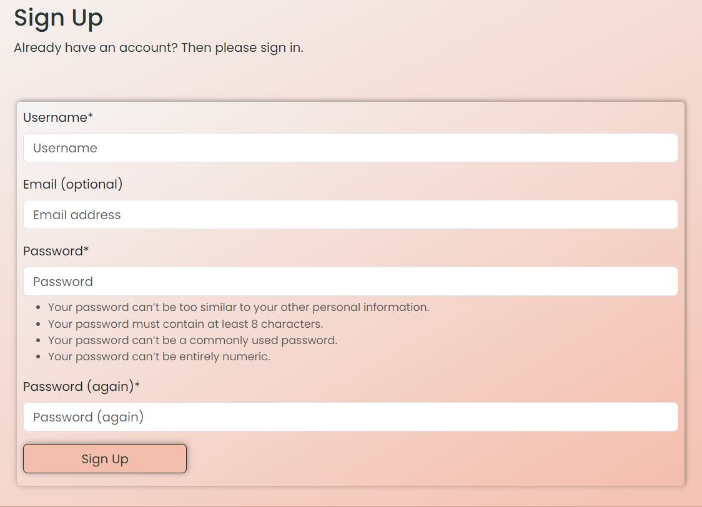

- **Sign Out**

    - After signing in if the user wants to logout he will be called to confirm his/hers decision. If the user clicks on the "Sign out" button he/she will be signed out.

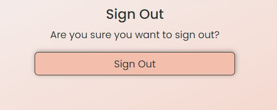

- **Home Page if the user is logged out**

    - The home page if the user is logged out has a welcome message and information about the site and how it can benefit the user.


- **Home Page if the user is logged in**

    - The home page if the user is logged in includes a welcome message and a motivational quote to inspire the user to start working. This quote is different everytime the page loads.


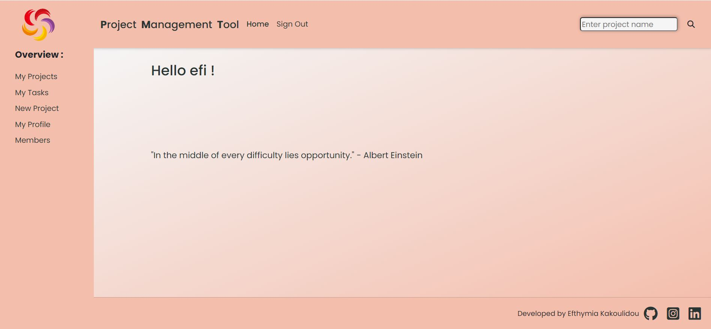

- **Navigation**

    - The home page when the user is logged in reveals the navigation. The navigation consists of the header that includes the home button and the choice to sign out. The content of the site lies on the left vertically and consists of the "My Projects", "My Tasks", "New Project", "Profile" and "Members" pages. When the user clicks on My Projects then all the projects created by him/her or that he/she has tasks assigned to him/her will appear along with all the tasks of that specific project. Under My Tasks all the tasks assigned to the user will appear. If he/she clicks on "New project a form to create a new project appear. If he/she clicks on "My profile" then there are 2 options : if he/she has already created a profile then a pafe with the rpofile imformation will appear otherwise he/she will get aform to create a profile. Under "Members" there is a list with all the users that have created a profile. For mobiles the navigation consists of a drop-down menu with a list of all the actions the user can do.

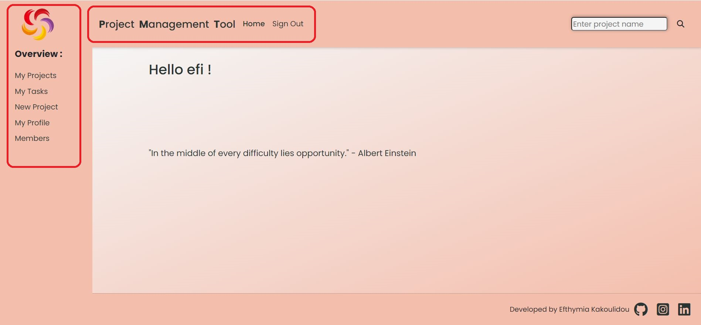
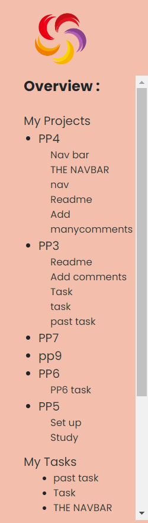
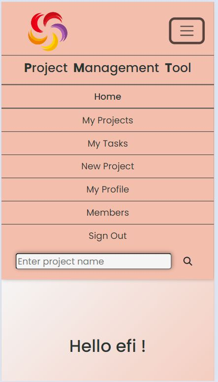

- **Search bar**

    - in the header of the page there is also a search bar that searches by the project's name. If the user enters a project name then he/she is redirected into the "My projects" page but will see just the project he/she searched for. This feature makes it easier for the user to isolate just the project he/she is interested in without having to scroll the side-nav-bar and find it.

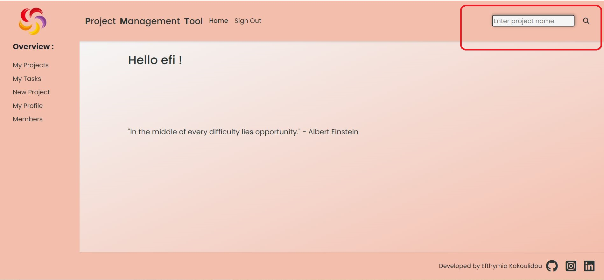

- **My projects**

    - This pages contains a collection of the projects that the user has created or has tasks assigned to him/her so that the user can easily see all the projects that involve him/her. The projects' information provided here is just the name of the project and its deadline so that user can organize his/her work.

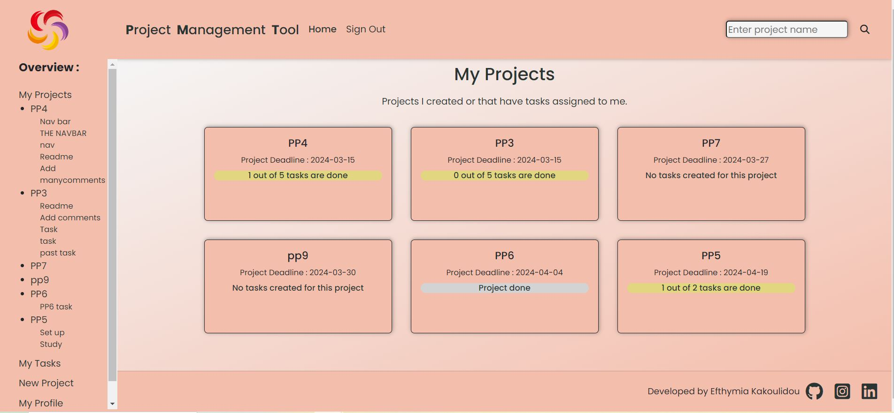

- **My Tasks**

    - On this page the user can see all the tasks assigned to him/her. They appear in order from the most urgent to least urgent. The information provided on this page is the name of the project the tasks belongs to, the name of the task, and the task's deadline. The tasks that have the "To do" status appear green, tasks that have the "In progress" status appear orange and tasks that are already done appear grey so that the user can ignore them.

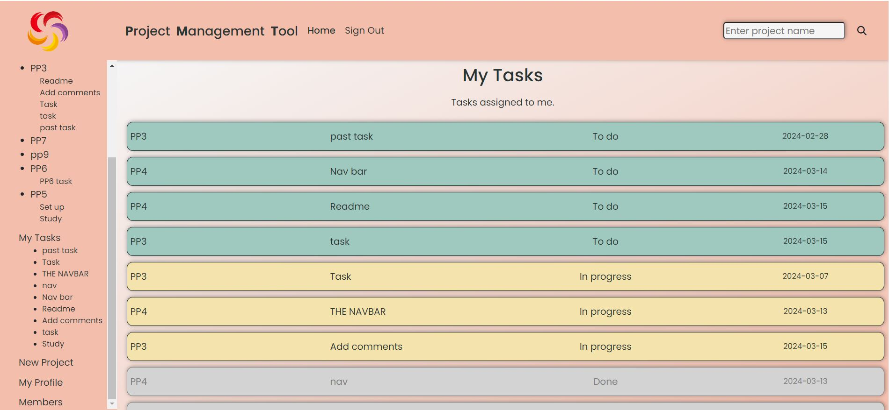

- **New Project**

    - If the user wants to create a new project he/she can do it directly from the navigation bar. The user is redirected to the "Add-project" form and there he/she can provide the information of the new project. The name of the project, its description and the deadline are the fields he/she has to fill.

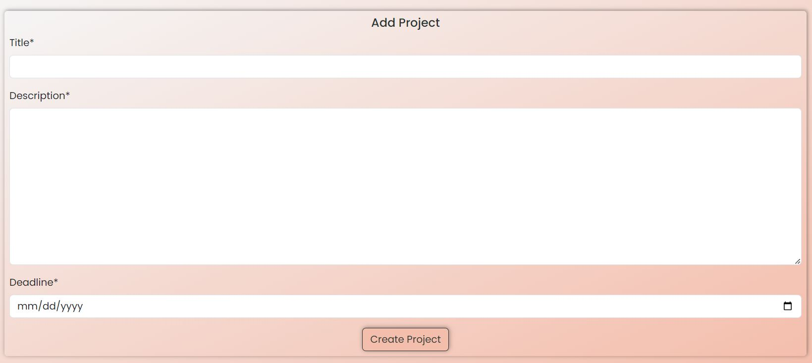

- **Profile**

    - By clicking on the 'Profile' on the home page the user is redirected to the add-profile form if he/she has not already created a profile or to his/hers profile page if the user has already created a profile. The fields on the profile form are "First Name", "Last Name", "Job Title", "Image" and "Bio". If the user has already created a profile the page with all that information will appear. All the fields except the image are mandatory. If the user does not provide a picture the default picture will appear instead.


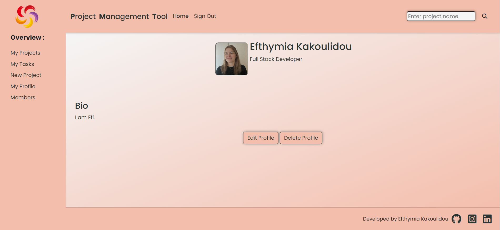

- **Members**

    - All profiles made on the site appear here. The information provided here are the picture, the first name and the job title.

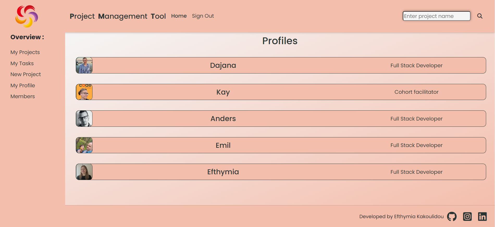

- **My Projects/project selected**

    - If the user clicks on a project from "My Projects" he/she is redirected to a page showing that project's details. There, the user can see the project's title, when it was created and by whom, the projects' description, the deadline of the project and a list of the tasks created for this project together with a button that gives him/her the chance to add a task. If the user has created the project he/she gets the option to edit or delete the project. If the user has not created the project those 2 buttons do not appear so the user can just add tasks. In the same time the name of the project appears under "My Projects" in the vertical navigation bar. This a link leading to the project's details page.
    - The user is redirected to this page when he/she successfully fills in the form to add a new project.


- **Add Task**

    - From the projects' detail page the user can add a task to aproject


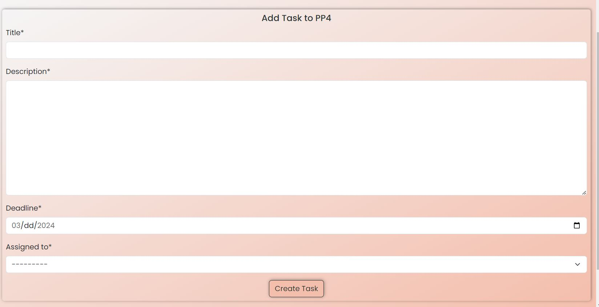

- **Task details page**

    - When the user clicks on a task either on the project's details page or on a task on the "My Tasks" page he/she is directed to the page showing all the details of the task. 
    - If the user has neither created the task or is not assigned the task (with other words he sees this task only because he is a member of that particular project) then : on the top there is the projects' title then to whom it was assigned to and from whom, then the task's description and the deadline. The name of the task appears under the name of the project in the vartical navigation bar but not under the My Tasks section.
    - If the user has created the task and is not assigned himself/herself the task then he/she gets the edit, delete buttons. Again the name of the task appears under the name of the project in the vertical navigation bar but not under the "My Tasks" section. 
    - If the user is assigned the task then he/she gets the update-status button. In this case the user cannot change the task otherwise. He/She can just change the status. This task appears now both under the project name and the My tasks section of the vertical navigation bar.
    - If the user is both the creator and the person the task was assigned to he/she gets all the options(edit the task, delete the task and update status.) and the task appears both under the project name it belongs to and the "My tasks" section of the vertical navigation bar.
    - In all cases when a task appears in the vertical navigation it is a link leading to the task's detail page.

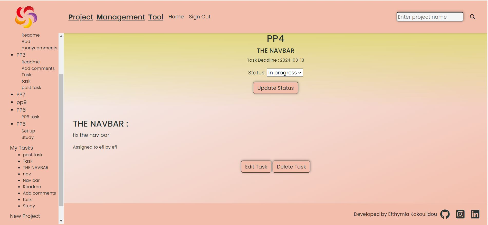
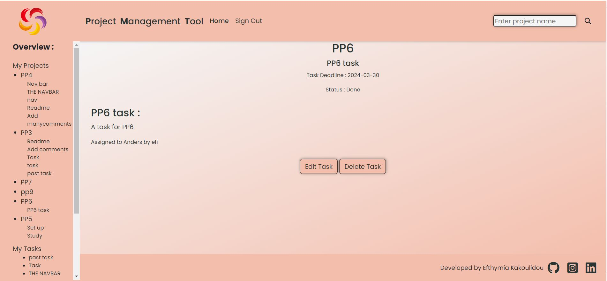
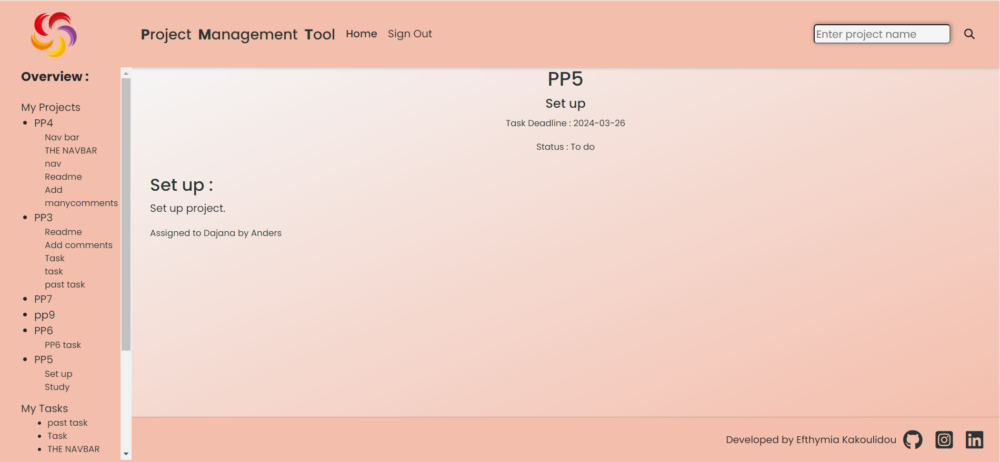

    - If the status of the task is set "To do" then the upper part of the background appears green.
    - If the status of the task is set "In progress" then the upper part of the background appears orange.
    - If the status of the task is set "Done" then the upper part of the background appears grey.


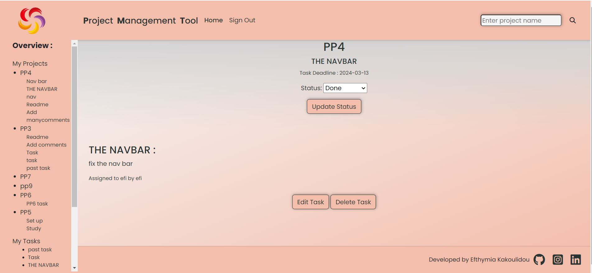
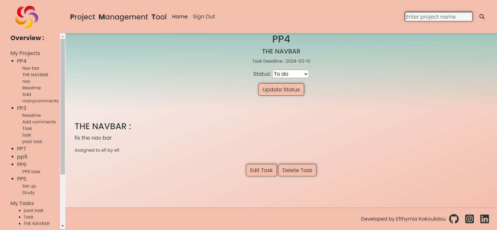

    - The general rule is that if you own a project or task you can edit or delete them otherwise you cannot alter them. The eception is that if you are assigned a task, so you are the one working on it, you can update its status because you are the one that can provide this information.

- **Edit or Delete Task**

    - When the task is created by the user, the user can edit or delete. By clicking on edit the edit-form appears filled with the information of the task that can be edited. If the form is sublited successfully the user is redirected the task-details page. By clicking on the delete button the user is redirected to the confirm deletion page and if confirmed to the project-details page. If the user changes his/her mind about editing the task then he/she always has the side navigation bar that informs him/her about the hierarchy of the content of the page and can navigate from there to the page he/she wants.


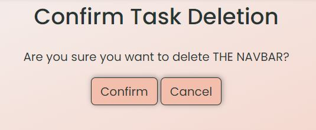


- **Edit or Delete my Projects**

    - The user can edit or delete the projects that he/she has created. By clicking on edit the user is redirected to the edit-project form. If the form is successfully submitted the user is redirected to the project's-details page.By clicking the delete button to the confirm deletion page and if confirmed to the his/hers projects page.


- **Edit or Delete my Profile**

    - If the user's profile is already created then the user can edit or delete it. By clicking on the edit button he is reditected to the edit-profile form. If the form is successfully submitted then the user gets to see his/hers profile page. By clicking on delete the user is reditected to confirm deletion page and if confirmed to the members page.

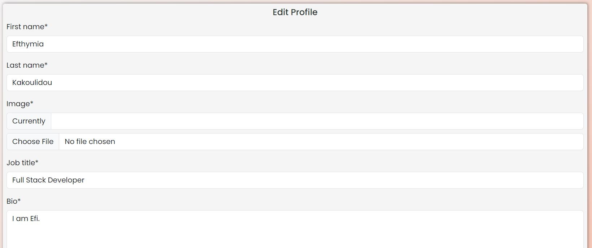


- **Members/members selected**

    - If the user clicks on one of the profiles he sees that profile's details with the options to edit or delete it if he/she owns the profile or without them if he/shes views another person's profile.


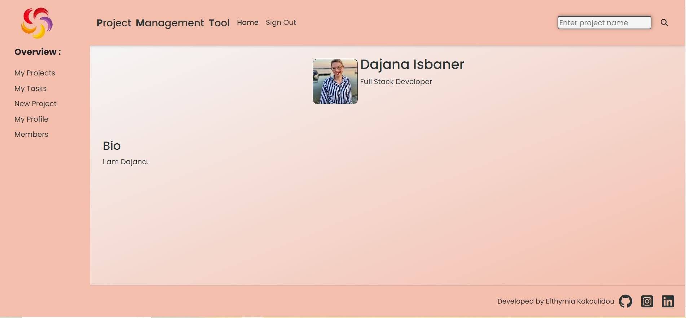

- **403, 404 pages**

    - If the user tries to access a page the he is not authorized to he/she gets a 403 page. In case the user tries a page that does not exist then he/she gets the 404 page.

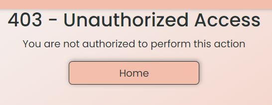
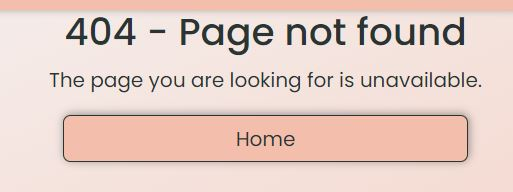

- **Messages**

    - The user is being informed constantly about his/hers actions.
    - If the user has successfully signed up.
    - If the user has successfully signed out.
    - If the user has successfully logged in.
    - If the user has successfully added a task.
    - If the user has successfully edited a task.
    - If the user has successfully deleted a task.
    - If the user has successfully updated the status of a task.
    - If the user has successfully added a project.
    - If the user has successfully edited a project.
    - If the user has successfully deleted a project.
    - If the user has successfully added a profile.
    - If the user has successfully edited a profile.
    - If the user has successfully deleted a profile.
    - If the user tries to give a task a deadline that is after the project's deadline.
    - If the user tries to give a task a deadline that is before the current date.
    - If the user tries to submit an empty form.

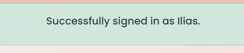
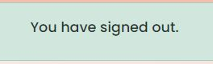
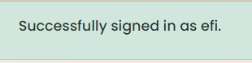
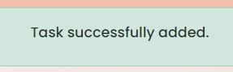
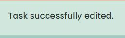
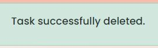
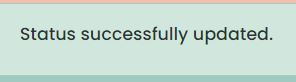
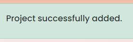
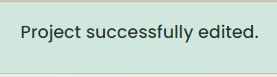
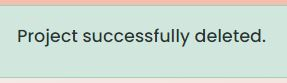
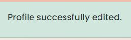
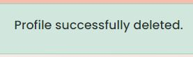
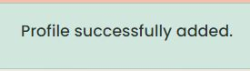
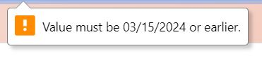
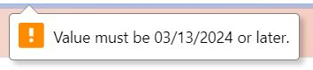
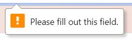

### Future Features

- Groups
    - In the future it would be helpful to create groups of profiles that work on a project so that when a task is created it could only be assigned to team members. This way I could narrow down the pool of profiles to make an even better choice about who is going to work on a specific task.
- Email notifications
    - It would be very helpful if someone got an email notification when a task is assigned to them so that they know directly their workload.
- Project templates
    - In the future when creating a project it ould be helpful to choose a template suited for the specific project. This would save time to the oganization of tasks created.
- Tasks that every profile has concluded
    - It would also be helpful to include in the profile-details a list of tasks that the particular person has done. This way someone can check the kind of experience everybody has and assign them tasks accordingly.

## Tools & Technologies Used

- [](https://git-scm.com) used for version control. (\`git add\`, \`git commit\`, \`git push\`)
- [](https://github.com) used for secure online code storage.
- [](https://gitpod.io) used as a cloud-based IDE for development.
- [](https://en.wikipedia.org/wiki/HTML) used for the main site content.
- [](https://en.wikipedia.org/wiki/CSS) used for the main site design and layout.
- [](https://www.javascript.com) used for user interaction on the site.
- [](https://www.python.org) used as the back-end programming language.
- [](https://www.heroku.com) used for hosting the deployed back-end site.
- [](https://getbootstrap.com) used as the front-end CSS framework for modern responsiveness and pre-built components.
- [](https://www.djangoproject.com) used as the Python framework for the site.
- [](https://www.postgresql.org) used as the relational database management.
- [](https://www.elephantsql.com) used as the Postgres database.
- [](https://cloudinary.com) used for online static file storage.
- [](https://whitenoise.readthedocs.io) used for serving static files with Heroku.
- [](https://balsamiq.com/wireframes) used for creating wireframes.
- [](https://fontawesome.com) used for the icons.

## Database Design

Entity Relationship Diagrams (ERD) help to visualize database architecture before creating models.
Understanding the relationships between different tables can save time later in the project.


```python
class Profile(models.Model):
    first_name = models.CharField(max_length=200, unique=True, null=False, blank=False)
    last_name = models.CharField(max_length=200, unique=True, null=False, blank=False)
    featured_image = CloudinaryField('image', default='placeholder')
    user = models.OneToOneField(
        User, on_delete=models.CASCADE, related_name="name"
    )
    job_title = models.CharField(max_length=200, unique=True, null=False, blank=False)
    bio = models.TextField(null=False, blank=False)
    created_on = models.DateTimeField(auto_now_add=True)

    def __str__(self):
        return self.first_name

class Project(models.Model):
    title = models.CharField(max_length=200, unique=True, null=False, blank=False)
    user = models.ForeignKey(
        User, on_delete=models.CASCADE, related_name="project_creation"
    )
    description = models.TextField(null=False, blank=False)
    created_on = models.DateTimeField(auto_now_add=True)
    deadline = models.DateTimeField(null=False, blank=False)

    def __str__(self):
        return self.title

class Task(models.Model):
    project = models.ForeignKey(Project, on_delete=models.CASCADE)
    title = models.CharField(max_length=200, null=False, blank=False)
    user = models.ForeignKey(
        User, on_delete=models.CASCADE, related_name="task_creator"
    )
    assigned_to = models.ForeignKey(
        User, on_delete=models.CASCADE, related_name="task_owner"
    )
    description = models.TextField(null=False, blank=False)
    created_on = models.DateTimeField(auto_now_add=True)
    updated_on = models.DateTimeField(auto_now=True)
    status = models.CharField(
        max_length=20, choices=STATUS, default="To do", null=False, blank=False
    )
    deadline = models.DateTimeField(null=False, blank=False)

    def __str__(self):
        return self.title
```


- Table: **Profile**

    | **PK** | **id** (unique) | Type | Notes |
    | --- | --- | --- | --- |
    | **OneToOne** | user | OneToOneField | One user can have one profile |
    | | first_name | CharField | |
    | | last_name | CharField | |
    | | featured_image | URLField | |
    | | job_title | CharField | |
    | | bio | Charfield | |
    | | created_on | DateTimeField | |

- Table: **Project**

    | **PK** | **id** (unique) | Type | Notes |
    | --- | --- | --- | --- |
    | **FK** | user | Foreignkey | One user can create many projects |
    | | title | CharField | |
    | | description | CharField | |
    | | created_on | DateTimeField | |
    | | deadline | DateTimeField | |

- Table: **Tasks**

    | **PK** | **id** (unique) | Type | Notes |
    | --- | --- | --- | --- |
    | **FK** | user | Foreignkey | One user can create many tasks |
    | **FK** | project | Foreignkey | One project can have many tasks |
    | | title | CharField | |
    | | description | CharField | |
    | | created_on | DateTimeField | |
    | | updated_on | DateTimeField | |
    | | status | CharField | |
    | | deadline | DateTimeField | |
    | | assigned_to | CharField | |

## Agile Development Process

### GitHub Projects

[GitHub Projects](https://github.com/EfthymiaKakoulidou/project-management-tool/projects) served as an Agile tool for this project.
It isn't a specialized tool, but with the right tags and project creation/issue assignments, it can be made to work.

Through it, user stories, issues, and milestone tasks were planned, then tracked on a weekly basis using the basic Kanban board.

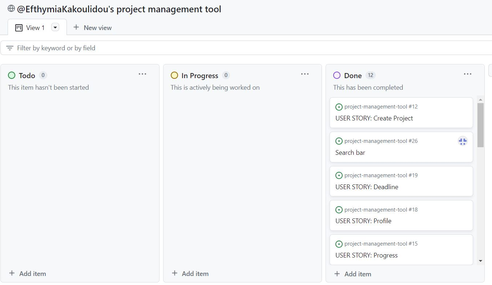

### GitHub Issues

[GitHub Issues](https://github.com/EfthymiaKakoulidou/project-management-tool/issues) served as an another Agile tool.
There, I used my own **User Story Template** to manage user stories.

It also helped with milestone iterations on a weekly basis.

- [Open Issues](https://github.com/EfthymiaKakoulidou/project-management-tool/issues) [](https://github.com/EfthymiaKakoulidou/project-management-tool/issues)

    

- [Closed Issues](https://github.com/EfthymiaKakoulidou/project-management-tool/issues?q=is%3Aissue+is%3Aclosed) [](https://github.com/EfthymiaKakoulidou/project-management-tool/issues?q=is%3Aissue+is%3Aclosed)

    

### MoSCoW Prioritization

I've decomposed my Epics into stories prior to prioritizing and implementing them.
Using this approach, I was able to apply the MoSCow prioritization and labels to my user stories within the Issues tab.

- **Must Have**: guaranteed to be delivered (*max 60% of stories*)
- **Should Have**: adds significant value, but not vital (*the rest ~20% of stories*)
- **Could Have**: has small impact if left out (*20% of stories*)
- **Won't Have**: not a priority for this iteration

## Testing

> [!NOTE]  
> For all testing, please refer to the [TESTING.md](TESTING.md) file.

## Deployment

The live deployed application can be found deployed on [Heroku](https://project-management-tool-70101b30ec1e.herokuapp.com).

### ElephantSQL Database

This project uses [ElephantSQL](https://www.elephantsql.com) for the PostgreSQL Database.

To obtain your own Postgres Database, sign-up with your GitHub account, then follow these steps:

- Click **Create New Instance** to start a new database.
- Provide a name (this is commonly the name of the project: project-management-tool).
- Select the **Tiny Turtle (Free)** plan.
- You can leave the **Tags** blank.
- Select the **Region** and **Data Center** closest to you.
- Once created, click on the new database name, where you can view the database URL and Password.

### Cloudinary API

This project uses the [Cloudinary API](https://cloudinary.com) to store media assets online, due to the fact that Heroku doesn't persist this type of data.

To obtain your own Cloudinary API key, create an account and log in.

- For *Primary interest*, you can choose *Programmable Media for image and video API*.
- Optional: *edit your assigned cloud name to something more memorable*.
- On your Cloudinary Dashboard, you can copy your **API Environment Variable**.
- Be sure to remove the `CLOUDINARY_URL=` as part of the API **value**; this is the **key**.

### Heroku Deployment

This project uses [Heroku](https://www.heroku.com), a platform as a service (PaaS) that enables developers to build, run, and operate applications entirely in the cloud.

Deployment steps are as follows, after account setup:

- Select **New** in the top-right corner of your Heroku Dashboard, and select **Create new app** from the dropdown menu.
- Your app name must be unique, and then choose a region closest to you (EU or USA), and finally, select **Create App**.
- From the new app **Settings**, click **Reveal Config Vars**, and set your environment variables.

> [!IMPORTANT]  
> This is a sample only; you would replace the values with your own if cloning/forking my repository.

| Key | Value |
| --- | --- |
| `CLOUDINARY_URL` | user's own value |
| `CLOUDINARY_NAME` | user's own value |
| `CLOUDINARY_API_KEY` | user's own value |
| `CLOUDINARY_SECRET` | user's own value |
| `DATABASE_URL` | user's own value |
| `DISABLE_COLLECTSTATIC` | 1 (*this is temporary, and can be removed for the final deployment*) |
| `SECRET_KEY` | user's own value |

Heroku needs two additional files in order to deploy properly.

- requirements.txt
- Procfile

You can install this project's **requirements** (where applicable) using:

- `pip3 install -r requirements.txt`

If you have your own packages that have been installed, then the requirements file needs updated using:

- `pip3 freeze --local > requirements.txt`

The **Procfile** can be created with the following command:

- `echo web: gunicorn app_name.wsgi > Procfile`
- *replace **app_name** with the name of your primary Django app name; the folder where settings.py is located*

For Heroku deployment, follow these steps to connect your own GitHub repository to the newly created app:

Either:

- Select **Automatic Deployment** from the Heroku app.

Or:

- In the Terminal/CLI, connect to Heroku using this command: `heroku login -i`
- Set the remote for Heroku: `heroku git:remote -a app_name` (replace *app_name* with your app name)
- After performing the standard Git `add`, `commit`, and `push` to GitHub, you can now type:
	- `git push heroku main`

The project should now be connected and deployed to Heroku!

### Local Deployment

This project can be cloned or forked in order to make a local copy on your own system.

For either method, you will need to install any applicable packages found within the *requirements.txt* file.

- `pip3 install -r requirements.txt`.

You will need to create a new file called `env.py` at the root-level,
and include the same environment variables listed above from the Heroku deployment steps.

> [!IMPORTANT]  
> This is a sample only; you would replace the values with your own if cloning/forking my repository.

Sample `env.py` file:

```python
import os

os.environ.setdefault("CLOUDINARY_URL", "user's own value")
os.environ.setdefault("CLOUDINARY_NAME", "user's own value")
os.environ.setdefault("CLOUDINARY_API_KEY", "user's own value")
os.environ.setdefault("CLOUDINARY_SECRET", "user's own value")
os.environ.setdefault("DATABASE_URL", "user's own value")
os.environ.setdefault("SECRET_KEY", "user's own value")

# local environment only (do not include these in production/deployment!)
os.environ.setdefault("DEBUG", "True")
```

Once the project is cloned or forked, in order to run it locally, you'll need to follow these steps:

- Start the Django app: `python3 manage.py runserver`
- Stop the app once it's loaded: `CTRL+C` or `⌘+C` (Mac)
- Make any necessary migrations: `python3 manage.py makemigrations`
- Migrate the data to the database: `python3 manage.py migrate`
- Create a superuser: `python3 manage.py createsuperuser`
- Load fixtures (if applicable): `python3 manage.py loaddata file-name.json` (repeat for each file)
- Everything should be ready now, so run the Django app again: `python3 manage.py runserver`

#### Cloning

You can clone the repository by following these steps:

1. Go to the [GitHub repository](https://github.com/EfthymiaKakoulidou/project-management-tool) 
2. Locate the Code button above the list of files and click it 
3. Select if you prefer to clone using HTTPS, SSH, or GitHub CLI and click the copy button to copy the URL to your clipboard
4. Open Git Bash or Terminal
5. Change the current working directory to the one where you want the cloned directory
6. In your IDE Terminal, type the following command to clone my repository:
	- `git clone https://github.com/EfthymiaKakoulidou/project-management-tool.git`
7. Press Enter to create your local clone.

Alternatively, if using Gitpod, you can click below to create your own workspace using this repository.

[](https://gitpod.io/#https://github.com/EfthymiaKakoulidou/project-management-tool)

Please note that in order to directly open the project in Gitpod, you need to have the browser extension installed.
A tutorial on how to do that can be found [here](https://www.gitpod.io/docs/configure/user-settings/browser-extension).

#### Forking

By forking the GitHub Repository, we make a copy of the original repository on our GitHub account to view and/or make changes without affecting the original owner's repository.
You can fork this repository by using the following steps:

1. Log in to GitHub and locate the [GitHub Repository](https://github.com/EfthymiaKakoulidou/project-management-tool)
2. At the top of the Repository (not top of page) just above the "Settings" Button on the menu, locate the "Fork" Button.
3. Once clicked, you should now have a copy of the original repository in your own GitHub account!

### Local VS Deployment

There are no differences between the local site and the deployed.


## Credits

Though I did not get any code from this tutorial it helped me structure me project:
https://www.youtube.com/playlist?list=PLXuTq6OsqZjbCSfiLNb2f1FOs8viArjWy

### Content

| Source | Location | Notes |
| --- | --- | --- |
| [Markdown Builder](https://tim.2bn.dev/markdown-builder) | README and TESTING | tool to help generate the Markdown files |
| [W3Schools](https://www.w3schools.com) | entire site | syntax |
| [Cgpt](https://chat.openai.com/) | entire site | for everything |


### Media

| Source | Location | Type | Notes |
| --- | --- | --- | --- |
| [jpgtree](https://jpgtree.com/freejpg/creative-company-logo_1197025.html) | logo | image | logo on the header |
| [icons](https://icons8.com/icons/set/project) | favicon | image | favicon on all pages |

### Acknowledgements

- I would like to thank my Code Institute mentor, [Tim Nelson](https://github.com/TravelTimN) for their support throughout the development of this project.
- I would like to thank the [Code Institute](https://codeinstitute.net) tutor team for their assistance with troubleshooting and debugging some project issues.
- I would like to thank the [Code Institute Slack community](https://code-institute-room.slack.com) for the moral support; it kept me going during periods of self doubt and imposter syndrome.
- I would like to thank my partner helping me to make this transition into software development.

