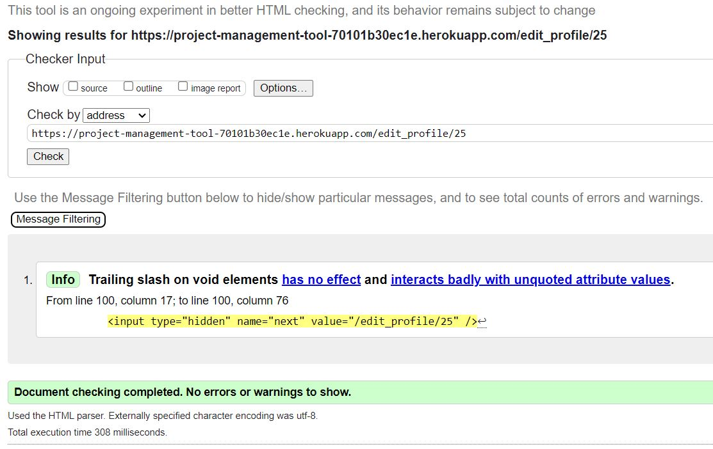
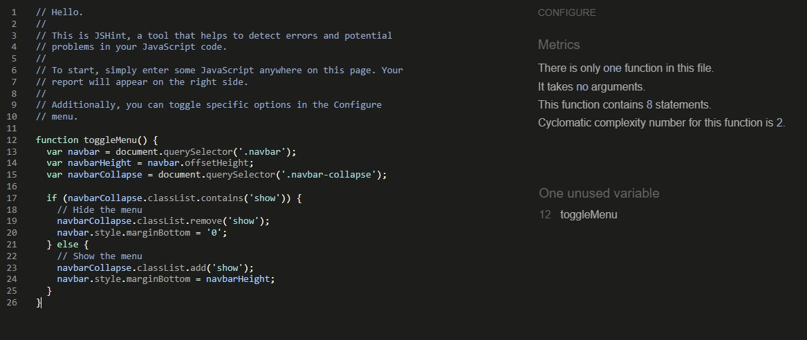
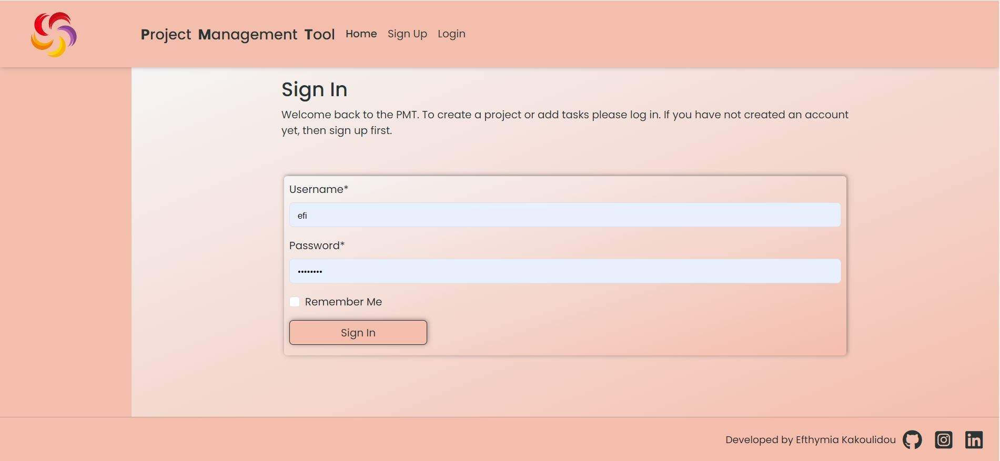
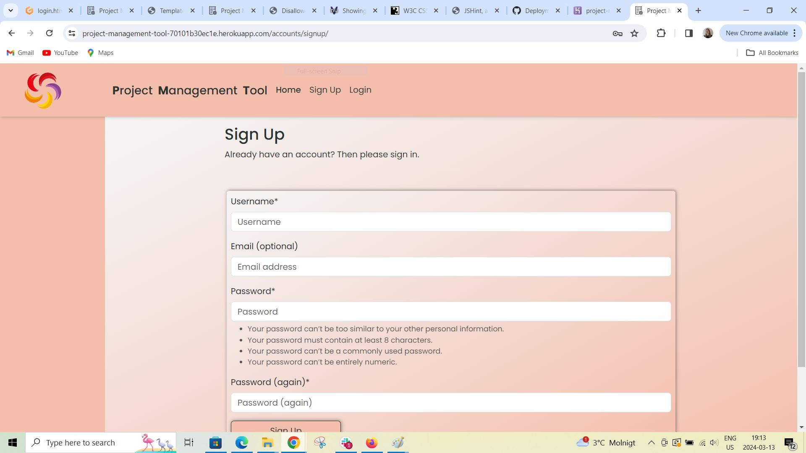
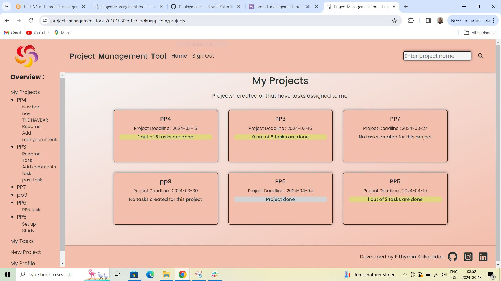
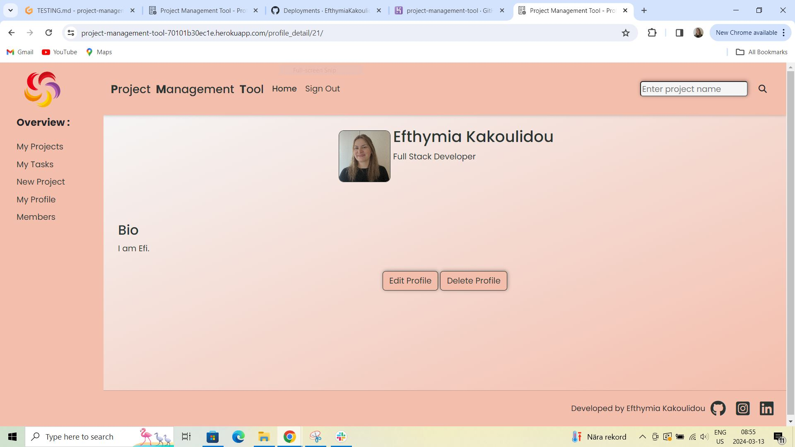
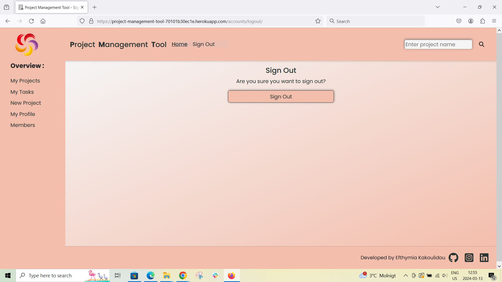
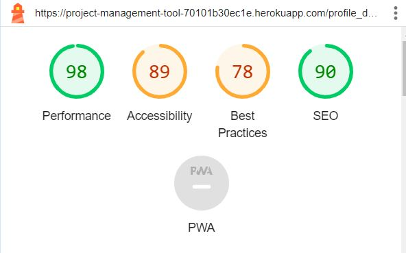
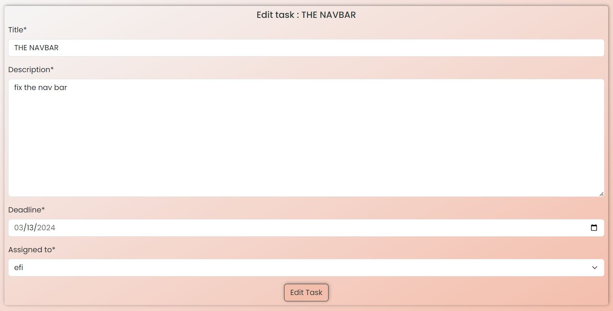

# Testing

> [!NOTE]  
> Return back to the [README.md](README.md) file.

## Code Validation

### HTML

I have used the recommended [HTML W3C Validator](https://validator.w3.org) to validate all of my HTML files.

| Directory | File | Screenshot | Notes |
| --- | --- | --- | --- |
| project_manager | add_profile.html |  | https://validator.w3.org/nu/?doc=https%3A%2F%2Fproject-management-tool-70101b30ec1e.herokuapp.com%2F |
| project_manager | add_project.html |  | https://validator.w3.org/nu/?doc=https%3A%2F%2Fproject-management-tool-70101b30ec1e.herokuapp.com%2Fadd_project |
| project_manager | add_task.html |  | https://validator.w3.org/nu/?doc=https%3A%2F%2Fproject-management-tool-70101b30ec1e.herokuapp.com%2Fadd_task%2F30%2F |
| project_manager | edit_profile.html |  | https://validator.w3.org/nu/?doc=https%3A%2F%2Fproject-management-tool-70101b30ec1e.herokuapp.com%2Fedit_profile%2F27 |
| project_manager | edit_project.html |  | https://validator.w3.org/nu/?doc=https%3A%2F%2Fproject-management-tool-70101b30ec1e.herokuapp.com%2Fedit%2F30|
| project_manager | edit_task.html |  | https://validator.w3.org/nu/?doc=https%3A%2F%2Fproject-management-tool-70101b30ec1e.herokuapp.com%2Fedit_task%2F73 |
| project_manager | edit_task_status.html |  | https://validator.w3.org/nu/?doc=https%3A%2F%2Fvalidator.w3.org%2Fnu%2F%3Fshowsource%3Dyes%26doc%3Dhttps%253A%252F%252Fproject-management-tool-70101b30ec1e.herokuapp.com%252Fprofile_detail%252F27%252F |
| project_manager | home.html |  | https://validator.w3.org/nu/?showsource=yes&doc=https%3A%2F%2Fproject-management-tool-70101b30ec1e.herokuapp.com%2F |
| project_manager | my_tasks.html |  | https://validator.w3.org/nu/?showsource=yes&doc=https%3A%2F%2Fproject-management-tool-70101b30ec1e.herokuapp.com%2Fmy_tasks |
| project_manager | profile_confirm_delete.html |  | https://validator.w3.org/nu/?showsource=yes&doc=https%3A%2F%2Fproject-management-tool-70101b30ec1e.herokuapp.com%2Fdelete_profile%2F27 |
| project_manager | profile_detail.html |  | https://validator.w3.org/nu/?showsource=yes&doc=https%3A%2F%2Fproject-management-tool-70101b30ec1e.herokuapp.com%2Fprofile_detail%2F27%2F |
| project_manager | profiles.html |  | https://validator.w3.org/nu/?showsource=yes&doc=https%3A%2F%2Fproject-management-tool-70101b30ec1e.herokuapp.com%2Fprofiles%2F |
| project_manager | project_confirm_delete.html |  | https://validator.w3.org/nu/?showsource=yes&doc=https%3A%2F%2Fproject-management-tool-70101b30ec1e.herokuapp.com%2Fdelete%2F30 |
| project_manager | project_detail.html |  | https://validator.w3.org/nu/?showsource=yes&doc=https%3A%2F%2Fproject-management-tool-70101b30ec1e.herokuapp.com%2Fproject_detail%2F30%2F |
| project_manager | projects.html |  | https://validator.w3.org/nu/?showsource=yes&doc=https%3A%2F%2Fproject-management-tool-70101b30ec1e.herokuapp.com%2Fprojects |
| project_manager | task_confirm_delete.html |  | https://validator.w3.org/nu/?showsource=yes&doc=https%3A%2F%2Fproject-management-tool-70101b30ec1e.herokuapp.com%2Fdelete_task%2F73 |
| templates | 403.html |  | |
| templates | 404.html |  | |
            
### CSS

I have used the recommended [CSS Jigsaw Validator](https://jigsaw.w3.org/css-validator) to validate all of my CSS files.

| Directory | File | Screenshot | Notes |
| --- | --- | --- | --- |
| static | base.css |  | |

            
### JavaScript

I have used the recommended [JShint Validator](https://jshint.com) to validate all of my JS files.

| Directory | File | Screenshot | Notes |
| --- | --- | --- | --- |
| static | script.js |  | |

            
### Python

I have used the recommended [PEP8 CI Python Linter](https://pep8ci.herokuapp.com) to validate all of my Python files.

| Directory | File | CI URL | Screenshot | Notes |
| --- | --- | --- | --- | --- |
|  | manage.py | [PEP8 CI](https://pep8ci.herokuapp.com/https://raw.githubusercontent.com/EfthymiaKakoulidou/project-management-tool/main/manage.py) |  | |
| my_project | settings.py | [PEP8 CI](https://pep8ci.herokuapp.com/https://raw.githubusercontent.com/EfthymiaKakoulidou/project-management-tool/main/my_project/settings.py) |  | |
| my_project | urls.py | [PEP8 CI](https://pep8ci.herokuapp.com/https://raw.githubusercontent.com/EfthymiaKakoulidou/project-management-tool/main/my_project/urls.py) |  | |
| project_manager | admin.py | [PEP8 CI](https://pep8ci.herokuapp.com/https://raw.githubusercontent.com/EfthymiaKakoulidou/project-management-tool/main/project_manager/admin.py) |  | |
| project_manager | forms.py | [PEP8 CI](https://pep8ci.herokuapp.com/https://raw.githubusercontent.com/EfthymiaKakoulidou/project-management-tool/main/project_manager/forms.py) |  | |
| project_manager | models.py | [PEP8 CI](https://pep8ci.herokuapp.com/https://raw.githubusercontent.com/EfthymiaKakoulidou/project-management-tool/main/project_manager/models.py) |  | |
| project_manager | urls.py | [PEP8 CI](https://pep8ci.herokuapp.com/https://raw.githubusercontent.com/EfthymiaKakoulidou/project-management-tool/main/project_manager/urls.py) |  | |
| project_manager | views.py | [PEP8 CI](https://pep8ci.herokuapp.com/https://raw.githubusercontent.com/EfthymiaKakoulidou/project-management-tool/main/project_manager/views.py) |  | |

## Browser Compatibility

I've tested my deployed project on multiple browsers to check for compatibility issues.

| Browser | Home | Home after login | Login | Signup | Signout | My Projects | My Tasks | New Project | My Profile (add) | My profile | Members | Profile detail | Edi Project | Delete Project | Add Task | Task Detail | Edit Task | Delete Task | Update Task Status | Edit Profile | Delete Profile | Notes |
| --- | --- | --- | --- | --- | --- | --- | --- | --- | --- | --- | --- | --- | --- | --- | --- | --- | --- | --- | --- | --- | --- | --- |
| Chrome |  |  |  |  |  |  |  |  |  | |  |  |  |  | |  |  |  |  |  |  | Works as expected |
| Firefox |  |  |  |  | |  |  |  |  |  |  |  |  |  |  | |  |  |  |  |  | Works as expected |
| Edge |  |  |  |  | |  |  |  |  |  |  |  |  |  |  |  | |  |  |  |  | Works as expected |

## Responsiveness

I've tested my deployed project on multiple devices to check for responsiveness issues.

| Device | Home | Home after login | Login | Signup | Signout | My Projects | My Tasks | New Project | My Profile (add) | My profile | Members | Profile detail | Edi Project | Delete Project | Add Task | Task Detail | Edit Task | Delete Task | Update Task Status | Edit Profile | Delete Profile | Notes |
| --- | --- | --- | --- | --- | --- | --- | --- | --- | --- | --- | --- | --- | --- | --- | --- | --- | --- | --- | --- | --- | --- | --- |
| Mobile (DevTools) |  |  |  |  |  |  |  |  |  |  |  |  |  |  |  |  |  |  |  |  |  | Works as expected |
| Tablet (DevTools) |  |  | |  |  |  | |  | |  |  |  |  | |  |  |  |  |  | |  | Works as expected |
| Desktop (DevTools) |  |  |  |  |  |  |  |  |  | |  |  |  |  | |  |  |  |  |  |  | Works as expected |

## Lighthouse Audit

I've tested my deployed project using the Lighthouse Audit tool to check for any major issues.

| Page | Mobile | Desktop | Notes |
| --- | --- | --- | --- |
| Home |  |  | no warnings |
| Home when logged in |  |  | no warnings |
| Login |  |  | no warnings |
| Signup |  |  | no warnings |
| Signout |  |  | no warnings |
| My Projects |  |  | no warnings |
| Project details |  |  | no warnings |
| Add Project |  |  | no warnings |
| Edit Project |  |  | no warnings |
| Delete Project |  |  | no warnings |
| My Tasks |  |  | no warnings |
| Task details |  |  | no warnings |
| Add Task |  |  | no warnings |
| Edit Task |  |  | no warnings |
| Update Task Status |  |  | no warnings |
| Delete Task |  |  | no warnings |
| Profiles |  |  | no warnings |
| Profile Details |  |  | no warnings |
| Add Profile |  |  | no warnings |
| Edit Profile |  |  | no warnings |
| Delete Profile |  |  | no warnings |

## Defensive Programming

Defensive programming was manually tested with the below user acceptance testing:

| Page | Expectation | Test | Result | Fix | Screenshot |
| --- | --- | --- | --- | --- | --- |
| Home | | | | | |
| | Signup feature is expected to create a user when the form is filled successfully | Tested the feature filling the form | The feature behaved as expected, and created a user | Test concluded and passed |  |
| | Login feature is expected to login an existing user when the user fills the form| Tested the feature by filling the form | The feature behaved as expected, and logged in the user | Test concluded and passed |  |
| | Signout feature is expected to logout the user when the user confirms signout| Tested the feature by confirming sign out | The feature behaved as expected, and signed the user out | Test concluded and passed |  |
| My Projects | | | | | |
| | My projects' cards are expected to redirect the user to the project's details when the user clicks on them. | Tested the feature by clicking one of them | The feature behaved as expected and led me to the project's details page | Test concluded and passed |  |
| | Project details page is expected to have the edit/delete buttons if the user is the creator of the project | Tested the feature by clicking a project I created | The feature behaved as expected and showed the buttons | Test concluded and passed |  |
| | Project details page is expected not to have the edit/delete buttons if the user is not the creator of the project | Tested the feature by clicking a project I did not creat | The feature behaved as expected and did not show the buttons | Test concluded and passed |  |
| | Edit Project page is expected to have a filled form with the details of the project for editing the project | Tested the feature by editing the details | The feature behaved as expected and edited the project | Test concluded and passed |  |
| | Delete confirmation page is expected to delete the project when the user clicks on confirm | Tested the feature by clicking the button | The feature behaved as expected and deleted the project | Test concluded and passed |  |
| | New Project page is expected to have a form for the creation of a project | Tested the feature by filling the form | The feature behaved as expected and created a project | Test concluded and passed |  |
| | Add Task button is expected to add a task to the project associated to it | Tested the feature by clicking the Add Task button| The feature behaved as expected and directed me to the Add Task form| Test concluded and passed |  |
| | Add Task form is expected to add a task to the project associated to it | Tested the feature by filling the form| The feature behaved as expected and created a task| Test concluded and passed |  |
| | Update status of the task is expected to update the status of this particular task | Tested the feature by changinf the status | The feature behaved as expected and updated status of the task| Test concluded and passed |    |
| | Edit Task form is expected to edit the task | Tested the feature by editing the details on the form| The feature behaved as expected and edited the task| Test concluded and passed |  |
| | Task delete confirmation is expected to delete the task when the user clicks the button | Tested the feature by clicking the button to confirm deletion| The feature behaved as expected and deleted the task| Test concluded and passed |  |
| | My Profile is expected to lead to the Add Profile form if the user does not have a profile or to the his/hers profile page if he/she have alreadya profile | Tested the feature by clicking on My Profile one time when I had a profile and one time if when I had not| The feature behaved as expected and led me to the respective page| Test concluded and passed |  |
| | Add Profile is expected to add a profile for the user when the user fills the form successfully | Tested the feature by filling the form | The feature behaved as expected and created my profile | Test concluded and passed |  |
| | Edit Profile is expected to show the form with the information of the profile to be able to edit it | Tested the feature by editing the information | The feature behaved as expected and edited my profile | Test concluded and passed |  |
| | Profile delete confirm is expected to delete the profile if the user confirms it | Tested the feature by clicking on the confirm button | The feature behaved as expected and deleted my profile | Test concluded and passed |  |

## User Story Testing

| User Story | Screenshot |
| --- | --- |
| As a new site user, I would like to sign up, so that I can enter the site. |  |
| As a new site user, I would like to create a project, so that I can start organizing my work. |  |
| As a new site user, I would like to create tasks for my projects, so that I can organize them into smaller segments. |  |
| As a new site user, I would like to assign tasks to others, so that I can delegate my work. |  |
| As a new site user, I would like to create my profile, so that others can see my information. |  |
| As a new site user, I would like to sign out, so that my work and my information are secure. |  |
| As a returning site user, I would like to login , so that I can have access to my previous work. |  |
| As a returning site user, I would like to create new projects and edit or delete my projects, so that I can update the information of my work. |  |
| As a returning site user, I would like to create, edit or delete tasks to the projects I have created, so that I can update the information of my work. |  |
| As a returning site user, I would like to edit or delete my profile, so that I can update my information. |  |
| As a returning site user, I would like to sign out, so that my work and information are secure. |  |
| As a site administrator, I should be able to see, create, edit and delete all the projects, tasks and profiles on the site, so that I can control the information on the site. |  |

## Automated Testing

I have conducted a series of automated tests on my application.

I fully acknowledge and understand that, in a real-world scenario, an extensive set of additional tests would be more comprehensive.

### Python (Unit Testing)

I have used Django's built-in unit testing framework to test the application functionality.

In order to run the tests, I ran the following command in the terminal each time:

`python3 manage.py test project_manager `

To create the coverage report, I would then run the following commands:

`coverage run --source=name-of-app manage.py test`

`coverage report`

To see the HTML version of the reports, and find out whether some pieces of code were missing, I ran the following commands:

`coverage html`

`python3 -m http.server`

Below are the results from the various apps on my application that I've tested:

| App | File | Coverage | Screenshot |
| --- | --- | --- | --- |
| project_manager | test_forms.py | 99% |  |
| project_manager | test_models.py | 89% |  |
| project_manager | test_urls.py | 100% |  |
| project_manager | test_views.py | 71% |  |

#### Unit Test Issues

## Bugs

- Python 

    - I encountered an error trying to to have 2 queries in one function separately and that did not work properly. 

    - To fix this, I I restrustured the code to make one query for all.

- Django `TemplateDoesNotExist`

    - To fix this, I adjusted my urls patterns accordingly to accept rendering from the respective views.

- Python `E501 line too long` 

    - To fix this, I cut the line so that it would continue to the next line without breaking the functionality..

### GitHub **Issues**

🛑🛑🛑🛑🛑🛑🛑🛑🛑🛑-START OF NOTES (to be deleted)

An improved way to manage bugs is to use the built-in **Issues** tracker on your GitHub repository.
To access your Issues, click on the "Issues" tab at the top of your repository.
Alternatively, use this link: https://github.com/EfthymiaKakoulidou/project-management-tool/issues

If using the Issues tracker for your bug management, you can simplify the documentation process.
Issues allow you to directly paste screenshots into the issue without having to first save the screenshot locally,
then uploading into your project.

You can add labels to your issues (`bug`), assign yourself as the owner, and add comments/updates as you progress with fixing the issue(s).

Once you've sorted the issue, you should then "Close" it.

When showcasing your bug tracking for assessment, you can use the following format:

🛑🛑🛑🛑🛑🛑🛑🛑🛑🛑-END OF NOTES (to be deleted)

**Fixed Bugs**

- When validating HTML the validator warned that there were unclosed tags. This happened because the closing tag was before the closing tag of an if statement which was not executed so the validator did not see it. I fixed this by moving the closing tag after the is statement.

All previously closed/fixed bugs can be tracked [here](https://github.com/EfthymiaKakoulidou/project-management-tool/issues?q=is%3Aissue+is%3Aclosed).

| Bug | Status |
| --- | --- |
| [JS Uncaught ReferenceError: `foobar` is undefined/not defined](https://github.com/EfthymiaKakoulidou/project-management-tool/issues/1) | Closed |
| [Python `'ModuleNotFoundError'` when trying to import module from imported package](https://github.com/EfthymiaKakoulidou/project-management-tool/issues/2) | Closed |
| [Django `TemplateDoesNotExist` at /appname/path appname/template_name.html](https://github.com/EfthymiaKakoulidou/project-management-tool/issues/3) | Closed |

**Open Issues**

Any remaining open issues can be tracked [here](https://github.com/EfthymiaKakoulidou/project-management-tool/issues).

| Bug | Status |
| --- | --- |
| [JS `'let'` or `'const'` or `'template literal syntax'` or `'arrow function syntax (=>)'` is available in ES6 (use `'esversion: 11'`) or Mozilla JS extensions (use moz).](https://github.com/EfthymiaKakoulidou/project-management-tool/issues/4) | Open |
| [Python `E501 line too long` (93 > 79 characters)](https://github.com/EfthymiaKakoulidou/project-management-tool/issues/5) | Open |

## Unfixed Bugs

    

    - Attempted fix: this is a known warning and acceptable, and my section doesn't require a header since it's dynamically added via JS.

There are no remaining bugs that I am aware of.
